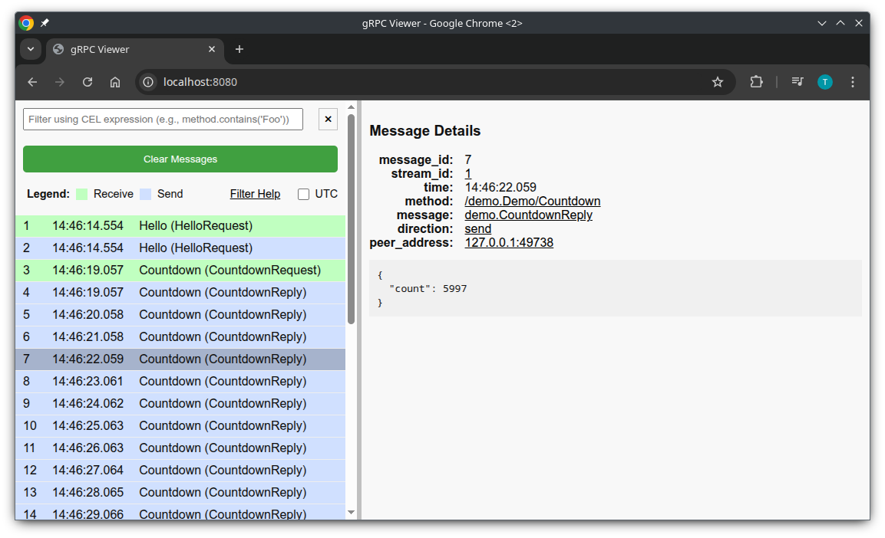

# gRPC JSON Sniffer for Go

gRPC JSON Sniffer is a Go module designed to capture and visualize gRPC messages in real-time.
It intercepts gRPC calls using both `grpc.StreamServerInterceptor` and `grpc.UnaryServerInterceptor` ([link](https://github.com/grpc/grpc-go/blob/master/examples/features/interceptor/README.md)), logs the calls to a JSON file, and provides a web-based interface for viewing and analyzing the captured messages.



## Usage

### Integration into a gRPC Server

To integrate the JSON Sniffer into your gRPC server, import the package and create a new JSON interceptor.
Then add the interceptor to your server options:

```go
import sniffer "github.com/tsaarni/grpc-json-sniffer"

// Create a new JSON interceptor
func setupGrpcServer() {
    // Create the interceptor. By default, logging is disabled.
    interceptor, err := sniffer.NewGrpcJsonInterceptor()
    if err != nil {
        // Handle error.
    }

    // Add interceptors to the gRPC server options.
    opts := []grpc.ServerOption{
        grpc.StreamInterceptor(interceptor.StreamServerInterceptor()),
        grpc.UnaryInterceptor(interceptor.UnaryServerInterceptor()),

        // Or use github.com/grpc-ecosystem/go-grpc-middleware to chain existing interceptors:
        // grpc.ChainStreamInterceptor(interceptor.StreamServerInterceptor(), <other>)
        // grpc.ChainUnaryInterceptor(interceptor.UnaryServerInterceptor(), <other>)
    }

    // Create new gRPC server with the options.
    s := grpc.NewServer(opts...)
    // ... further setup.
}
```

See [`example/server/server.go`](example/server/server.go) for full example.

By default the interceptor does not capture any messages.
Its functionality is enabled by following environment variables:

- `GRPC_JSON_SNIFFER_FILE` - Setting this variable enables the interceptor to log messages to a JSON file, for example `/tmp/grpc_capture.json`.
- `GRPC_JSON_SNIFFER_ADDR` - Setting this variable enables the web server to serve the web viewer and captured messages, for example `localhost:8080`.

The interceptor can be configured programmatically using options:

```go
interceptor, err := sniffer.NewGrpcJsonInterceptor(
    sniffer.WithFilename("/tmp/grpc_capture.json"),
    sniffer.WithAddr("localhost:8080"),
)
```

## Developing

The repository includes example gRPC server and client implementations located in the [`example`](example) directory.
These can be used to test the gRPC JSON Sniffer.
To start the gRPC server with the JSON interceptor, run:

```bash
go run -tags live_public github.com/tsaarni/grpc-json-sniffer/example/server
```

The `live_public` tag is used to enable the web server that serves static files from the `public` directory, for development purposes.
Otherwise, the files embedded during the build process are used.

Access the captured messages by visiting [http://localhost:8080](http://localhost:8080).

Send a greeting request:

```bash
go run github.com/tsaarni/grpc-json-sniffer/example/client -action greetings -param Joe
```

Send a countdown request:

```bash
go run github.com/tsaarni/grpc-json-sniffer/example/client -action countdown -param 10
```
